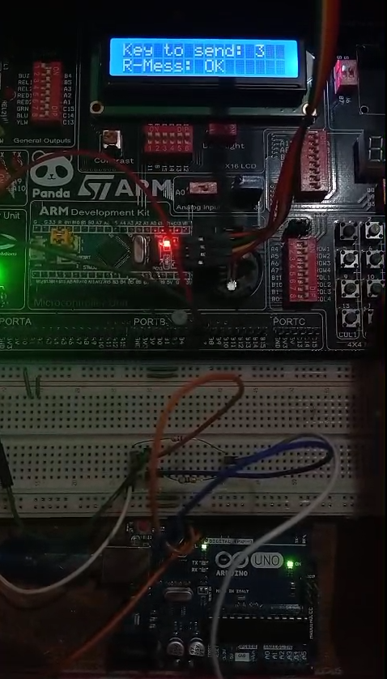
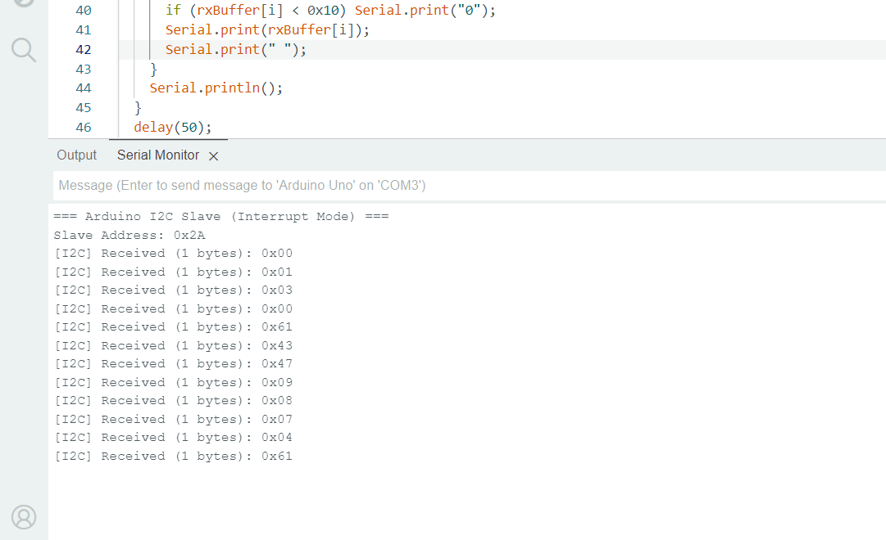

# I2C Communication Demo: Master-Slave Data Exchange

## 📌 Project Description
This project demonstrates a **practical I2C communication** between an STM32F103C8T6 (Master) and an Arduino Uno (Slave).  
The system reads numbers from a **Keypad**, sends them via **I2C** from Master to Slave, and receives a response message indicating whether the input is valid. The Master displays the input and the response on an **LCD**.

"This project is designed for learning and testing **I2C Master-Slave communication** in embedded systems and can be expanded to control other devices using I2C."

---

## 🛠 Features
- STM32F103C8T6 as **I2C Master**.  
- Arduino Uno as **I2C Slave**.  
- Keypad input for sending numbers.  
- LCD display for real-time input and response.  
- Simple **OK / ERROR feedback** based on input validation.  
- Fully demonstrates **I2C communication protocol** in a real embedded system.

---

## ⚙️ How It Works
1. **Master (STM32)** reads a number from the **Keypad**.  
2. The number is **displayed on the first row** of the LCD.  
3. Master sends the number via **I2C** to the **Slave (Arduino Uno)**.  
4. Slave checks the number:  
   - If the number is between **0–9**, it sends back `"OK"`.  
   - Otherwise, it sends back `"ERROR"`.  
5. Master receives the response and displays it on the **second row** of the LCD.

---
## 🗂 Documentation
- **Video Demo:** [Watch on YouTube](https://youtube.com/shorts/zCzk297x4xI?feature=share)

- **🖼️ Take a Quick look** 

  

  

---

## 🔧 Hardware Required
- STM32F103C8T6 Board (Master)  
- Arduino Uno (Slave)  
- 4x4 or 3x4 Keypad  
- LCD 16x2 (I2C or Parallel)  
- Connecting wires and breadboard    

---

## 💻 Software Requirements
- STM32CubeIDE (for STM32 firmware)  
- Arduino IDE (for Arduino Uno firmware)  

---

## 📝 How to Use
1. Connect the hardware as per the **wiring diagram**.  
2. Power on both STM32 and Arduino boards.  
3. Enter a number using the Keypad connected to the STM32.  
4. The entered number appears on the **first row** of the LCD.  
5. The STM32 sends the number to the Arduino via **I2C**.  
6. The Arduino responds with `"OK"` if the number is valid, `"ERROR"` otherwise.  
7. The response appears on the **second row** of the LCD.

**Tip:** Ensure both devices share a common ground (GND) for I2C communication.
---

## ⚡ Notes
- This project can be extended to multiple slaves by assigning **different I2C addresses**.  
- You can also control external devices (like Relays or Motors) based on Keypad input.  
- Ensure **I2C pull-up resistors** (typically 4.7kΩ–10kΩ) are connected if not built-in.
